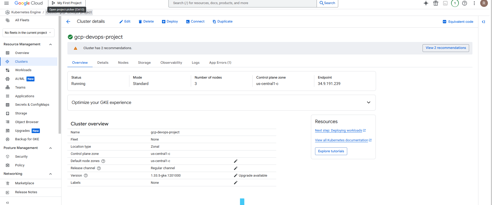
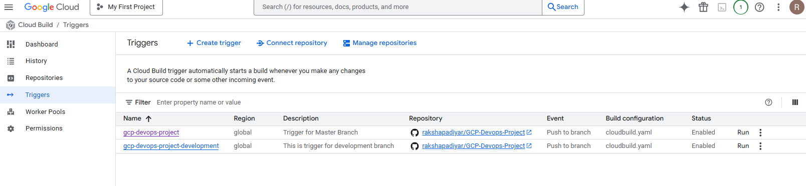
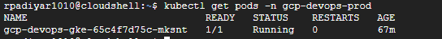
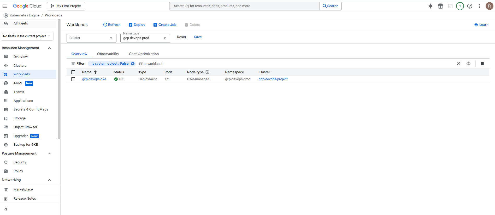
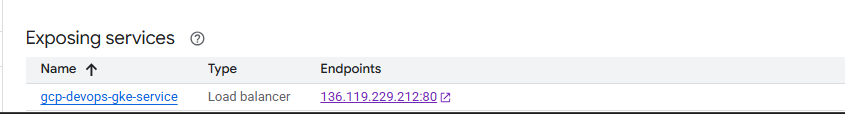
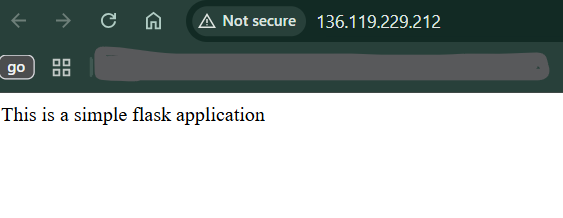
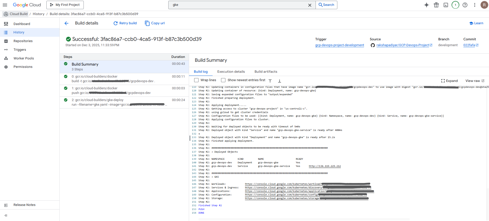
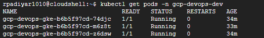
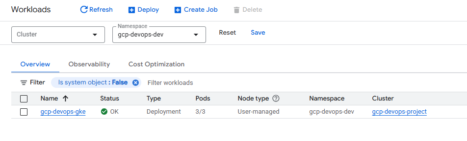

# GCP DevOps Project

This project demonstrates a complete CI/CD pipeline on Google Cloud Platform using Cloud Build, Artifact Registry, and Google Kubernetes Engine (GKE). It covers the workflow from application development to automated image building, storage, deployment, and multi-environment rollout (prod and dev).

---

## Sprints Summary

### Sprint 1 — Project Setup and Dockerization
- Created a GitHub repository and cloned it locally.
- Updated README and pushed changes.
- Built a basic Flask application.
- Wrote a Dockerfile and built the Docker image.
- Ran the image locally on `localhost:5000`.
- Pushed code to branch `feature/task-02` and merged to master.

### Sprint 2 — GCP Setup and Kubernetes Basics
- Used an existing GCP account.
- Explored basics of Kubernetes.
- Tested how to create a GKE cluster.

### Sprint 3 — CI/CD System Design
- Designed the CI/CD architecture.
- Selected:
  - **Cloud Build** for CI/CD automation
  - **Artifact Registry** for container image storage
- Planned flow:  
  **Cloud Build → Build Image → Push to Artifact Registry → GKE pulls and deploys**

### Sprint 4 — Automating Image Build (CI)
- Explored Cloud Build features.
- Connected GitHub repo to Cloud Build via triggers.
- Created branch `minor/cloudbuild` for CI config.
- Wrote `cloudbuild.yaml` to:
  - Build Docker image
  - Push to Artifact Registry
- Configured trigger for master branch.
- Verified images successfully appeared in Artifact Registry.

### Sprint 5 — Deployment Setup (CD)
- Created production namespace `gcp-devops-prod`.
- Wrote Kubernetes deployment YAML.
- Updated `cloudbuild.yaml` to automatically deploy the built image to GKE.
- Cloud Build now handled:
  - Image build
  - Image push
  - Deployment to GKE

### Sprint 6 — Load Balancer Service
- Wrote a Kubernetes LoadBalancer service YAML.
- Committed to branch `minor/service`, created PR, and merged.
- Verified:
  - A service was created in GKE
  - A public external IP was assigned

### Sprint 7 — Development Environment Setup
- Created a new **dev branch**.
- Updated Cloud Build config to:
  - Use a new image name with `/dev` suffix
  - Deploy to namespace `gcp-devops-dev`
- Created a Cloud Build trigger for dev branch.
- Created dev namespace in GKE.
- Validated:
  - Dev deployments triggered automatically on dev branch pushes
  

  - Updating replicas from 1 → 3 updated only the dev namespace
  - Production remained stable with 1 replica

---

## Skills Demonstrated
- Docker image creation and containerization
- Flask application packaging and deployment
- Cloud Build CI/CD automation
- Artifact Registry usage
- GKE cluster usage and workload management
- Kubernetes deployments and LoadBalancer services
- Multi-environment architecture (prod + dev)
- Git branching, pull requests, merging workflows

---